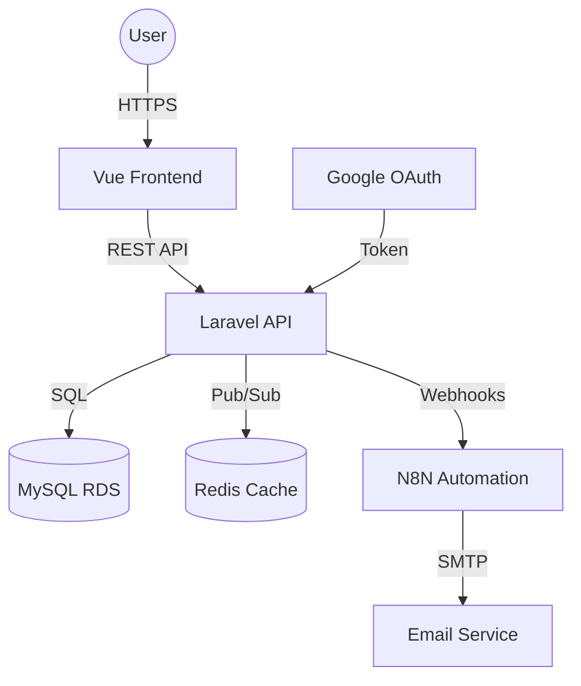

# Global Architecture & System Design

## Overview
**J&A Sports** is a decoupled web application following a Client-Server architecture. The system is designed to be scalable, secure, and maintainable, leveraging modern cloud infrastructure.

## System Components

### 1. Backend (API)
- **Framework**: Laravel 11 (PHP 8.3)
- **Role**: Serves as the core logic engine, providing a RESTful API for the frontend and external services.
- **Key Features**:
    - **Authentication**: Laravel Sanctum for SPA and Mobile-ready token management.
    - **OAuth2**: Integrated with Google Workspace for Social Login.
    - **Authorization**: Custom Role-based Access Control (RBAC) (Admin, Client, Guest).
    - **Business Logic**: Product management, order processing, and review systems.
    - **Integrations**: Webhooks (N8N) for automated email notifications and external events.

### 2. Frontend (Client)
- **Framework**: Vue 3 (Composition API)
- **Role**: Single Page Application (SPA) providing a rich, reactive user experience.
- **Key Features**:
    - **Navigation**: Vue Router for client-side routing.
    - **State Management**: Pinia for global state (Auth, Cart).
    - **UI/UX**: Bootstrap 5 + Custom CSS (Vibrant/Premium design).
    - **Validation**: Vee-Validate + Yup for real-time form checking.

### 3. Database & Storage
- **Primary Database**: MySQL 8.x (Hosted on AWS RDS in production).
- **Caching & Sessions**: Redis (7-alpine).
- **File Storage**: FTP server for managing product assets and backups.

## Relations & Data Flow

## Security Layer
- **Encryption**: All communications are encrypted via SSL/TLS (HTTPS).
- **Sanctum**: CSRF protection and Secure Cookies for the SPA.
- **Access Control**: Middlewares protect sensitive routes based on Sanctum tokens and User Roles.
- **CORS**: Strictly configured to only allow known origins.
