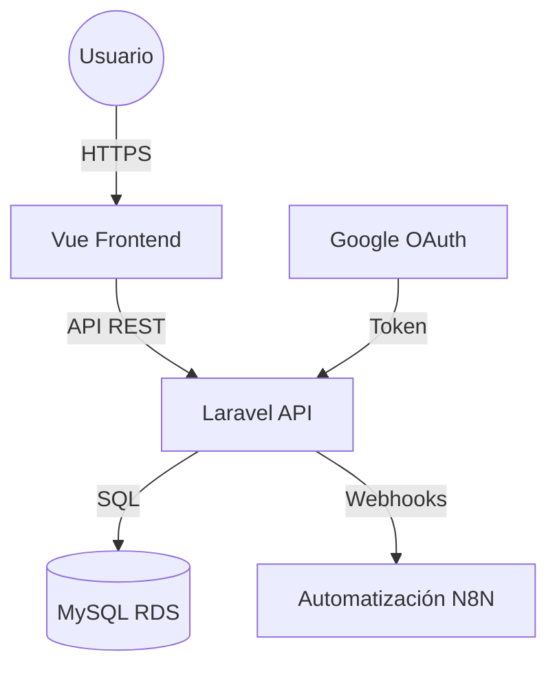

# Arquitectura Global y Diseño del Sistema

## Descripción General

**J&A Sports** es una aplicación web desacoplada que sigue una arquitectura Cliente-Servidor. El sistema está diseñado para ser escalable, seguro y mantenible, aprovechando la infraestructura moderna en la nube.

## Componentes del Sistema

### 1. Backend (API)

- **Framework**: Laravel 11 (PHP 8.3)
- **Rol**: Sirve como el motor de lógica central, proporcionando una API RESTful para el frontend y servicios externos.
- **Características Clave**:
    - **Autenticación**: Laravel Sanctum para gestión de tokens preparada para SPA y móviles.
    - **OAuth2**: Integrado con Google Workspace para inicio de sesión social.
    - **Autorización**: Control de Acceso Basado en Roles (RBAC) personalizado (Admin, Cliente, Invitado).
    - **Lógica de Negocio**: Gestión de productos, procesamiento de pedidos y sistemas de reseñas.
    - **Integraciones**: Webhooks (N8N) para notificaciones automáticas por correo electrónico y eventos externos.

### 2. Frontend (Cliente)

- **Framework**: Vue 3 (Composition API)
- **Rol**: Single Page Application (SPA) que proporciona una experiencia de usuario rica y reactiva.
- **Características Clave**:
    - **Navegación**: Vue Router para enrutamiento en el lado del cliente.
    - **Gestión de Estado**: Pinia para el estado global (Autenticación, Carrito).
    - **IU/UX**: Bootstrap 5 + CSS personalizado (Diseño vibrante/premium).
    - **Validación**: Vee-Validate + Yup para comprobación de formularios en tiempo real.

### 3. Base de Datos y Almacenamiento

- **Base de Datos Principal**: MySQL 8.x (Alojada en AWS RDS en producción).
- **Almacenamiento de Archivos**: Servidor FTP para gestionar activos de productos y copias de seguridad.

## Relaciones y Flujo de Datos

```mermaid
graph TD
    User((Usuario)) -->|HTTPS| Frontend[Vue Frontend]
    Frontend -->|API REST| Backend[Laravel API]
    Backend -->|SQL| RDS[(MySQL RDS)]
    Backend -->|Webhooks| N8N[Automatización N8N]
    Auth[Google OAuth] -->|Token| Backend
```

## Capa de Seguridad

- **Cifrado**: Todas las comunicaciones están cifradas via SSL/TLS (HTTPS).
- **Sanctum**: Protección CSRF y Cookies Seguras para la SPA.
- **Control de Acceso**: Los middlewares protegen las rutas sensibles basándose en los tokens de Sanctum y los roles de usuario.
- **CORS**: Estrictamente configurado para permitir solo orígenes conocidos.
