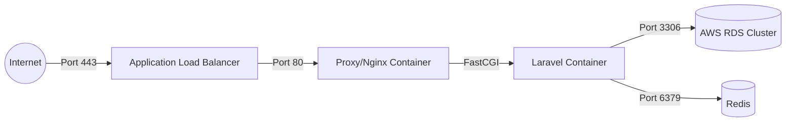

# Infrastructure & CI/CD Documentation

## Environments

### 1. Development (Docker)
- **Tool**: Docker Compose
- **Profiles**:
    - `app`: Full local environment (Laravel + Redis + FTP + phpMyAdmin).
    - `frontend`: Independent Vue development server with HMR.
    - `test`: Isolated environment for automated testing.
- **Access**:
    - App: `http://localhost:8000`
    - phpMyAdmin: `http://localhost:8080`
    - FTP: `localhost:21`

### 2. Production (AWS)
- **Compute**: EC2 instances managed via Docker.
- **Database**: AWS RDS (MySQL) with automated backups and Multi-AZ capabilities.
- **Entry Point**: AWS Application Load Balancer (ALB) for SSL termination and traffic distribution.
- **DNS**: Managed via custom DNS zone (`projecteXX.ddaw.es`).
- **HTTPS**: Let's Encrypt certificates managed automatically.

## Infrastructure Diagram

## CI/CD Pipelines (GitHub Actions)

### Backend Pipeline (`backend-deploy.yml`)
1. **Trigger**: Push to `main` (excluding `frontend/**`).
2. **Phase 1: Test**: Installs dependencies, runs `php artisan test`.
3. **Phase 2: Deploy**: 
    - Connects to self-hosted runner.
    - Pulls latest code.
    - Rebuilds container (`COMPOSE_PROFILES=app`).
    - Executes `migrate --force`.
    - Clears and rebuilds caches (`config`, `route`).

### Frontend Pipeline (`frontend-deploy.yml`)
1. **Trigger**: Push to `main` in `frontend/`.
2. **Phase 1: Build & Deploy**:
    - Connects to self-hosted runner.
    - Rebuilds frontend container (`COMPOSE_PROFILES=frontend`).
    - Nginx inside container serves optimized static assets.

## Scalability & Availability
- **RDS Multi-AZ**: High availability and failover for the data layer.
- **Docker Isolation**: Each service runs in its own bounded container.
- **Profiles**: Allows granular scaling of frontend vs backend components.
