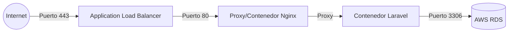

# Documentación de Infraestructura y CI/CD

## Entornos

### 1. Desarrollo (Docker)

- **Herramienta**: Docker Compose
- **Perfiles (Profiles)**:
    - `app`: Entorno local completo (Laravel + Redis + FTP + phpMyAdmin).
    - `frontend`: Servidor de desarrollo de Vue independiente con HMR.
    - `test`: Entorno aislado para pruebas automatizadas.
- **Acceso**:
    - Frontend: `http://localhost:5173`
    - App: `http://localhost:8000`
    - phpMyAdmin: `http://localhost:8080`
    - FTP: `localhost:21`

### 2. Producción (AWS)

- **Computación**: Instancias EC2 gestionadas a través de Docker.
- **Base de Datos**: AWS RDS (MySQL) con copias de seguridad automatizadas y capacidades Multi-AZ.
- **Punto de Entrada**: AWS Application Load Balancer (ALB) para la terminación de SSL y distribución de tráfico.
- **DNS**: Gestionado a través de una zona DNS personalizada (`projecteXX.ddaw.es`).
- **HTTPS**: Certificados de Let's Encrypt gestionados automáticamente.

## Diagrama de Infraestructura

```mermaid
graph LR
    Internet((Internet)) -->|Puerto 443| ALB[Application Load Balancer]
    ALB -->|Puerto 80| Nginx[Proxy/Contenedor Nginx]
    Nginx -->|Proxy| App[Contenedor Laravel]
    App -->|Puerto 3306| RDS[(AWS RDS)]
```

## Pipelines de CI/CD (GitHub Actions)

### Pipeline del Backend (`backend-deploy.yml`)

1. **Activador (Trigger)**: Push a `main` (excluyendo `frontend/**`).
2. **Fase 1: Pruebas (Test)**: Instala dependencias, ejecuta `php artisan test`.
3. **Fase 2: Despliegue (Deploy)**:
    - Se conecta al corredor (runner) autoalojado.
    - Descarga el código más reciente.
    - Reconstruye el contenedor (`COMPOSE_PROFILES=app`).
    - Ejecuta `migrate --force`.
    - Limpia y reconstruye las cachés (`config`, `route`).

### Pipeline del Frontend (`frontend-deploy.yml`)

1. **Activador (Trigger)**: Push a `main` dentro de `frontend/`.
2. **Fase 1: Construcción y Despliegue (Build & Deploy)**:
    - Se conecta al corredor (runner) autoalojado.
    - Reconstruye el contenedor del frontend (`COMPOSE_PROFILES=frontend`).
    - Nginx dentro del contenedor sirve los activos estáticos optimizados.

## Escalabilidad y Disponibilidad

- **RDS Multi-AZ**: Alta disponibilidad y conmutación por error (failover) para la capa de datos.
- **Aislamiento Docker**: Cada servicio se ejecuta en su propio contenedor delimitado.
- **Perfiles**: Permite un escalado granular de los componentes del frontend frente a los del backend.
